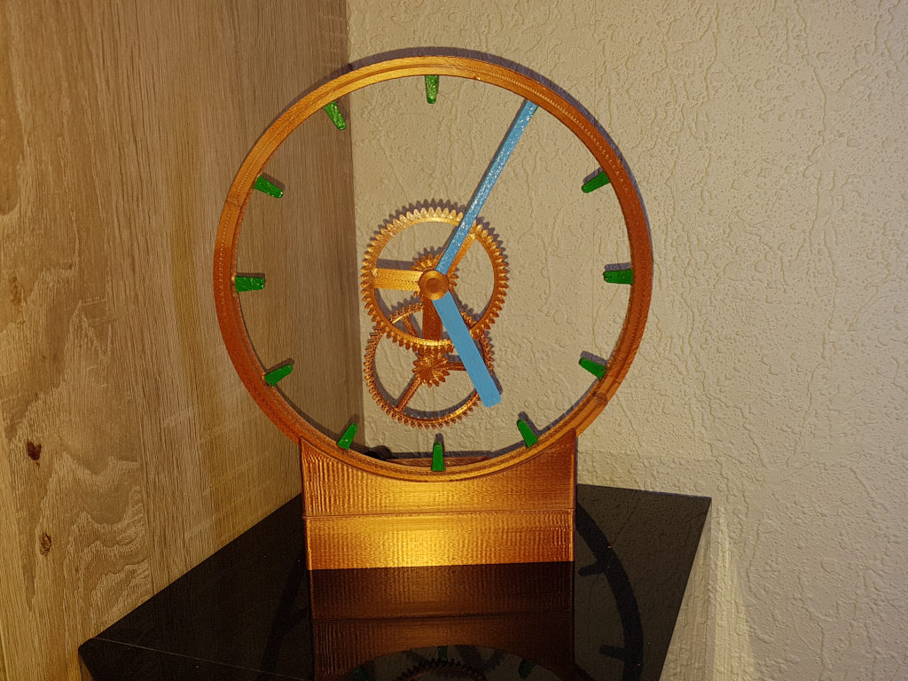
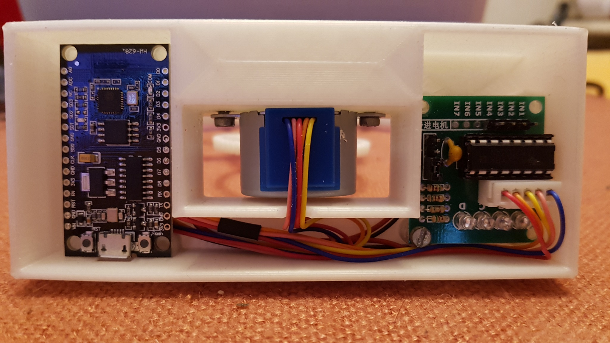

# HollowClock
# An analog clock with flying hands controlled from internet-time via ESP8266 
https://github.com/xSnowHeadx/HollowClock

README file  
SnowHead Mar 2021  

## Introduction
Shiura on [thingiverse](https://www.thingiverse.com/thing:4781365) designed a fascinating hollow clock. 
The original is controlled by an Arduino. The firmware here was adapted to an ESP8266 and for the use of the [WTA-timeservice](http://worldtimeapi.org) instead of NTP. So there normally are no firmware-modifications necessary to adapt the timezone and DST because they will be investigated out of the public IP of the request. For special cases (f.e. the use of a foreign proxy server) the timezone can be selected manually by replacing "ip" with the wished [timezone](http://worldtimeapi.org/timezone) in WTAClient.cpp. 
 
##Used libraries: 
- ArduinoJson 
- DNSServer 
- DoubleResetDetector 
- ESP8266HTTPClient 
- ESP8266WebServer 
- ESP8266WiFi 
- WiFiManager  

Some modified mechanic parts are described [here](https://www.prusaprinters.org/prints/140533-hollow-clock-remix-uses-internet-time-with-esp8266) 
See informations to arduino-based version on [thingiverse](https://www.thingiverse.com/thing:4781365)
